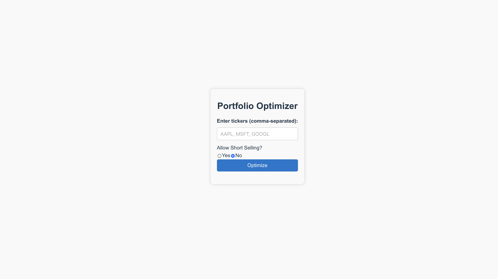
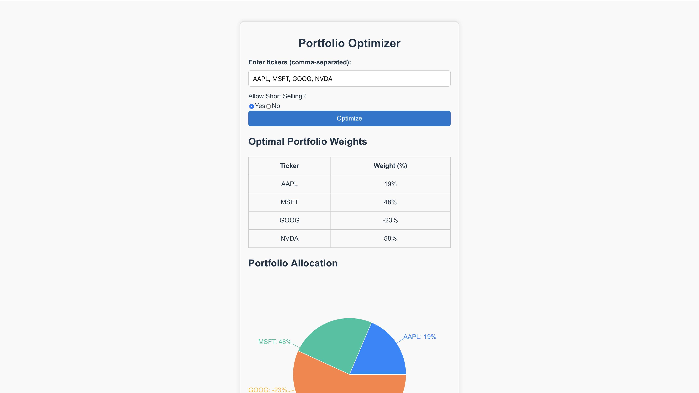
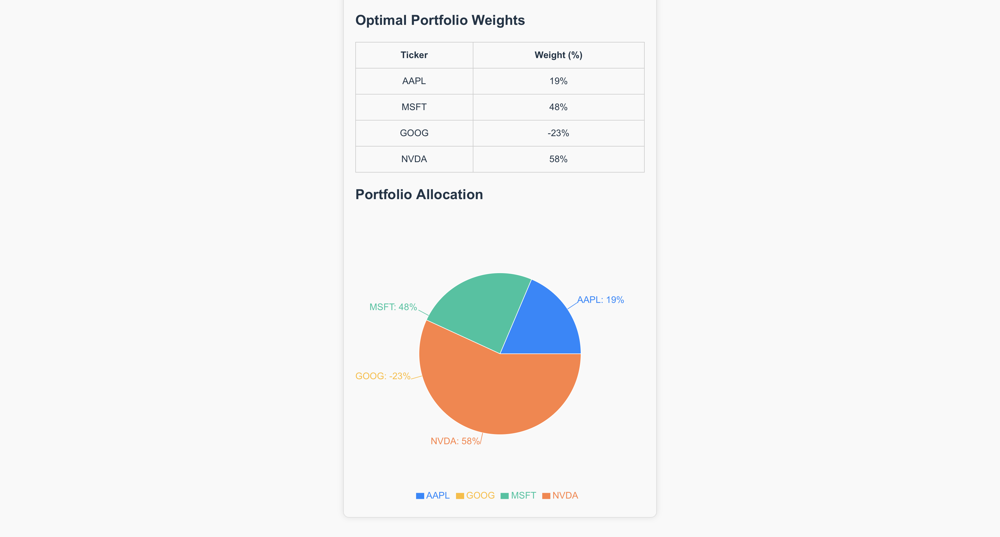

# 📈 Portfolio Optimization Web App
A full-stack application for mean-variance portfolio optimization with optional short selling.
## 🚀 Features
* Mean–variance optimization using the Markowitz model
* Toggle short selling (long-only or long-short portfolios)
* Automatic optimal weights calculation
* Visualizes allocations with an interactive pie chart
* FastAPI backend + React frontend
* Real stock data (Yahoo Finance API)
## 🧠 How It Works
1. User enters a list of tickers
2. App fetches historical price data
3. Expected returns + covariance matrix are computed
4. Optimization solves for:
   * Minimum variance portfolio
   * Maximum return for a given risk
   * (Optional) Short-selling constraints
5. Final optimal weights are displayed in a table and visualized with an interactive pie chart.
## 🛠️ Tech Stack
- **Frontend:** React, JavaScript, CSS
- **Backend:** FastAPI (Python)
- **Optimization:** NumPy, Pandas, CVXPY
- **Charts:** Recharts
- **Data:** yfinance
## 📦 Installation & Setup
### 1. Clone the repo
   ```
   git clone https://github.com/isben2006/Portfolio-Optimizer-App.git
   cd portfolio-optimizer
   ```
### 2. Backend Setup
   ```
   cd backend
   pip install -r requirements.txt
   uvicorn main:app --reload
   ```
### 3. Frontend Setup
   ```
   cd frontend
   npm install
   npm run dev
   ```
## 📸 Screenshots



